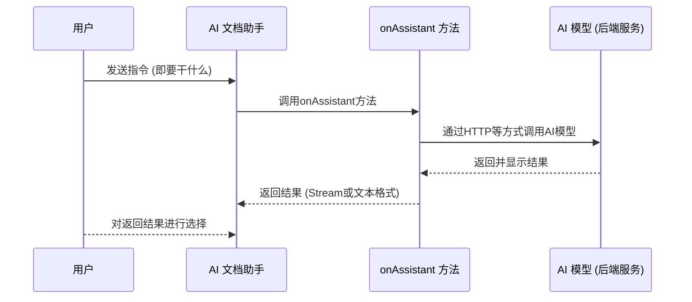

# AI 文档助手

AI 文档助手是一个集成人工智能技术效率工具，主要设计用于提高文档创作的效率。

AI 文档助手将用户选择的内容和输入的指令等信息传递给 AI 模型，AI 模型根据这些信息，生成符合要求的文档内容，并将结果返回给 AI 文档助手。

## 技术原理

### 流程说明
1. 用户向 AI 文档助手发送指令，说明他们想要执行的操作；
2. AI 文档助手随后调用名为 onAssistant 的方法；
3. onAssistant 方法通过 HTTP 或其他方式向 AI 模型发起调用；
4. AI 模型处理请求，然后返回并显示结果；
5. onAssistant 方法将结果以可读流或文本格式返回给 AI 文档助手；
6. 用户对AI 文档助手返回的结果进行选择。

### 流程序列图

## 使用场景

AI 文档助手可以应用于多种场景，提供高效、智能的文档处理服务。以下是一些常见的使用场景：

1. **文档翻译**：将文档从一种语言翻译成另一种语言。
2. **文档摘要**：自动生成文档内容的摘要或概述。
3. **内容校对**：检查文档中的语法错误、拼写错误等。
4. **格式转换**：将文档从一种格式转换为另一种格式，如PDF转Word。
5. **信息提取**：从文档中提取关键信息，如人名、地点、日期等。
6. **内容推荐**：根据用户的历史阅读习惯推荐相关文档。
7. **智能写作**：根据用户的输入，生成符合要求的文档内容。
8. **数据录入**：将纸质文档或图片中的数据转换为电子格式。
9. **文档整理**：帮助用户整理杂乱无章的文档，使其有序。
10. **知识管理**：构建知识库，帮助用户管理和检索信息。
11. **自动化报告生成**：根据数据和模板自动生成报告。
12. **法律文档审查**：帮助法律专业人士审查合同和其他法律文件。
13. **学术研究**：辅助研究人员进行文献搜索、资料整理和引用管理。
14. **教育辅助**：帮助教师和学生进行课程资料的整理和学习笔记的制作。
15. **更多使用场景**：...

通过 AI 文档助手，可以大大提高工作效率，减少重复性劳动，让用户能够专注于更有创造性和战略性的任务。
