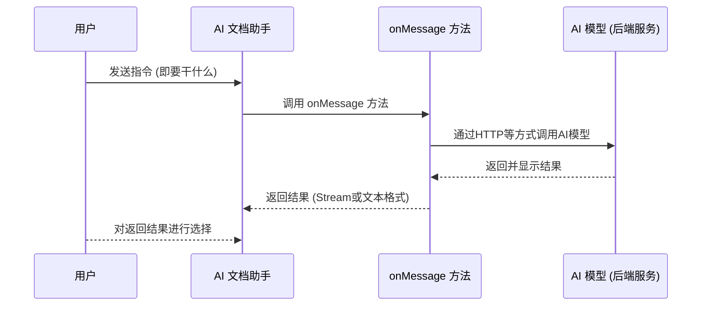

import { Tabs, Callout } from 'nextra/components'
import { Badge } from '/components/badge'

# AI 文档助手

AI 文档助手是一种面向文档编辑场景的智能交互能力，旨在帮助用户高效处理文档内容。

它支持基于选中文本或上下文执行续写、重写、扩写、缩写、润色、校阅、翻译等常见文档操作，并通过可配置的指令体系，将用户意图精准传递给 AI 模型，生成符合当前语言和格式要求的结果。

AI 文档助手可与多种大模型无缝集成，支持流式返回与富文本输出，适用于写作辅助、内容优化、多语言处理等场景，显著提升文档编辑效率与内容质量。

## 效果截图

// TODO

## 演示视频

// TODO

## 技术原理

### 流程说明

1. 用户向 AI 文档助手发送指令，说明想要执行的操作；
2. AI 文档助手随后调用名为 ai.assistant.onMessage 的方法；
3. ai.assistant.onMessage 方法通过 HTTP 或其他方式向 AI 模型发起调用；
4. AI 模型处理请求，然后返回并显示结果；
5. ai.assistant.onMessage 方法将结果以可读流或文本格式返回给 AI 文档助手；
6. 用户对AI 文档助手返回的结果进行选择。

### 流程序列图



## 使用场景

AI 文档助手可以应用于多种场景，提供高效、智能的文档处理服务。以下是一些常见的使用场景：

1. **文档翻译**：将文档从一种语言翻译成另一种语言。
2. **文档摘要**：自动生成文档内容的摘要或概述。
3. **内容校对**：检查文档中的语法错误、拼写错误等。
4. **格式转换**：将文档从一种格式转换为另一种格式，如PDF转Word。
5. **信息提取**：从文档中提取关键信息，如人名、地点、日期等。
6. **内容推荐**：根据用户的历史阅读习惯推荐相关文档。
7. **智能写作**：根据用户的输入，生成符合要求的文档内容。
8. **数据录入**：将纸质文档或图片中的数据转换为电子格式。
9. **文档整理**：帮助用户整理杂乱无章的文档，使其有序。
10. **知识管理**：构建知识库，帮助用户管理和检索信息。
11. **自动化报告生成**：根据数据和模板自动生成报告。
12. **法律文档审查**：帮助法律专业人士审查合同和其他法律文件。
13. **学术研究**：辅助研究人员进行文献搜索、资料整理和引用管理。
14. **教育辅助**：帮助教师和学生进行课程资料的整理和学习笔记的制作。
15. **更多使用场景**：...

通过 AI 文档助手，可以大大提高工作效率，减少重复性劳动，让用户能够专注于更有创造性和战略性的任务。

## 默认配置

```js
{
  ai:{
    assistant: {
      enabled: false,
      maxlength: 100,
      commands: [
        {
          label: { en_US: 'Continuation', zh_CN: '续写' },
          value: { en_US: 'Continuation', zh_CN: '续写' },
        },
        {
          label: { en_US: 'Rewrite', zh_CN: '重写' },
          value: { en_US: 'Rewrite', zh_CN: '重写' },
        },
        {
          label: { en_US: 'Abbreviation', zh_CN: '缩写' },
          value: { en_US: 'Abbreviation', zh_CN: '缩写' },
        },
        {
          label: { en_US: 'Expansion', zh_CN: '扩写' },
          value: { en_US: 'Expansion', zh_CN: '扩写' },
        },
        {
          label: { en_US: 'Polish', zh_CN: '润色' },
          value: { en_US: 'Polish', zh_CN: '润色' },
        },
        {
          label: { en_US: 'Proofread', zh_CN: '校阅' },
          value: { en_US: 'Proofread', zh_CN: '校阅' },
        },
        {
          label: { en_US: 'Translate', zh_CN: '翻译' },
          value: { en_US: 'Translate to chinese', zh_CN: '翻译成英文' },
          autoSend: false,
        },
      ],
      async onMessage() {
        return await new Promise((_, reject) => {
          reject(
            new Error(
              'Key "ai": Key "assistant": Key "onMessage": Please set the onMessage method',
            ),
          )
        })
      },
    },
  },
}
```

## 配置项说明

### ai.assistant.enabled

**说明**：是否开启 AI 文档助手功能。

**类型**：`Boolean`

**默认值**：`false`

### ai.assistant.maxlength

**说明**：AI 文档助手允许输入的最大命令长度。

**类型**：`Number`

**默认值**：`100`

### ai.assistant.commands

**说明**：AI 文档助手面板中常用指令配置。

**类型**：`Array`

**默认值**：

```js
;[
  {
    label: { en_US: 'Continuation', zh_CN: '续写' },
    value: { en_US: 'Continuation', zh_CN: '续写' },
  },
  {
    label: { en_US: 'Rewrite', zh_CN: '重写' },
    value: { en_US: 'Rewrite', zh_CN: '重写' },
  },
  {
    label: { en_US: 'Abbreviation', zh_CN: '缩写' },
    value: { en_US: 'Abbreviation', zh_CN: '缩写' },
  },
  {
    label: { en_US: 'Expansion', zh_CN: '扩写' },
    value: { en_US: 'Expansion', zh_CN: '扩写' },
  },
  {
    label: { en_US: 'Polish', zh_CN: '润色' },
    value: { en_US: 'Polish', zh_CN: '润色' },
  },
  {
    label: { en_US: 'Proofread', zh_CN: '校阅' },
    value: { en_US: 'Proofread', zh_CN: '校阅' },
  },
  {
    label: { en_US: 'Translate', zh_CN: '翻译' },
    value: { en_US: 'Translate to chinese', zh_CN: '翻译成英文' },
    autoSend: false,
  },
]
```

**配置项**：

- `item.label`: `String` 或 `Object`，AI 文档助手面板中显示的文案。
- `item.value`: `String` 或 `Object`，发送给 `onMessage` 的实际指令。
- `item.autoSend`: `Boolean`，在用户选择该指令时，是否自动向 `onMessage` 发送指令，默认为 `true`，设为 `false` 时，用户可以修改该指令后，手动点击按钮发送指令。

### ai.assistant.onMessage

**说明**：配置 AI 文档助手返回数据的方法。

**类型**：`AsyncFunction`、 `Promise`。

**参数**：

- `payload`：AI 文档助手的请求参数，可以将这些信息传递给 AI 模型。
  1. `payload.lang`：`String`，当前界面语言。
  2. `payload.input`：`String`，用户选择的文本内容。
  3. `payload.command`：`String`，用户输入的指令。
  4. `payload.output`：`String`，AI 文档助手希望得到的内容格式，可能的值：`rich-text`、`text`。
- `content`：当前文档内容。可以将文档内容传递给 AI 模型，但是注意，过长的文档可能会导致 AI 模型无法处理。如果使用的是商业 AI 模型，过长的 Token 输入，也会导致计费剧增。
  1. `content.text`：`String`，当前文档的文本内容。
  2. `content.html`：`String`，当前文档的 HTML 内容。
  3. `content.json`：`Object`，当前文档的 JSON 内容。

**示例**：

以下示例以调用 OpenAI 模型为例，演示如何配置 `onMessage` 方法，将文档内容传递给 AI 模型，处理并返回 AI 模型的返回结果。

OpenAI 的接口规范已成为事实上的行业规范，实际上，很多 AI 模型都支持通过[`OpenAI SDK`](https://www.npmjs.com/package/openai)调用。

<Tabs items={['全局配置', 'SFC 配置']}>
<Tabs.Tab>
```js
import { useUmoEditor } from '@umoteam/editor'
import OpenAI from 'openai'

const onMessage = async (payload, content) => {
  console.log(payload, content)
  const { command, lang, input, output } = payload
  const client = new OpenAI({
    baseURL: '...',
    apiKey: '...',
    dangerouslyAllowBrowser: true, // 允许在浏览器中使用 OpenAI SDK
  })
  const langs = {
    'en-US': '英文',
    'zh-CN': '中文',
  }
  const options = {
    stream: true,
    model: '...',
    messages: [
      {
        role: 'system',
        content: `你是一个文档助手，根据用户输入的文本或者HTML内容，以及对应操作指令，生成符合要求的文档内容。要求如下：1.如果指令不是要求翻译内容，请使用${langs[lang]}返回，否则按用户要求翻译的语言返回；2.返回${output === 'rich-text' ? '富文本（HTML）' : '纯文本（剔除内容中的HTML标记）'}格式；3.如果用户输入的指令你不能理解，在返回的内容前加上“[ERROR]: ”，4.除此之外不返回任何其他多余的内容。`,
      },
      {
        role: 'user',
        content: `对以下内容进行：【${command}】操作。\n${input}`,
      },
    ],
  }
  const completion = await client.chat.completions.create(options)
  const stream = new ReadableStream({
    async start(controller) {
      for await (const chunk of completion) {
        controller.enqueue(chunk.choices[0]?.delta?.content || '')
      }
      controller.close()
    },
  })
  return stream
}

const options = {
  ai: {
    assistant: {
      enabled: true,
      onMessage,
    },
  },
}

app.use(useUmoEditor, options)
````
</Tabs.Tab>
<Tabs.Tab>
```vue
<template>
  <umo-editor
    v-bind="options"
  />
</template>

<script setup>
import { UmoEditor } from '@umoteam/editor'
import OpenAI from 'openai'

const onMessage = async (payload, content) => {
  console.log(payload, content)
  const { command, lang, input, output } = payload
  const client = new OpenAI({
    baseURL: '...',
    apiKey: '...',
    dangerouslyAllowBrowser: true, // 允许在浏览器中使用 OpenAI SDK
  })
  const langs = {
    'en-US': '英文',
    'zh-CN': '中文',
  }
  const options = {
    stream: true,
    model: '...',
    messages: [
      {
        role: 'system',
        content: `你是一个文档助手，根据用户输入的文本或者HTML内容，以及对应操作指令，生成符合要求的文档内容。要求如下：1.如果指令不是要求翻译内容，请使用${langs[lang]}返回，否则按用户要求翻译的语言返回；2.返回${output === 'rich-text' ? '富文本（HTML）' : '纯文本（剔除内容中的HTML标记）'}格式；3.如果用户输入的指令你不能理解，在返回的内容前加上“[ERROR]: ”，4.除此之外不返回任何其他多余的内容。`,
      },
      {
        role: 'user',
        content: `对以下内容进行：【${command}】操作。\n${input}`,
      },
    ],
  }
  const completion = await client.chat.completions.create(options)
  const stream = new ReadableStream({
    async start(controller) {
      for await (const chunk of completion) {
        controller.enqueue(chunk.choices[0]?.delta?.content || '')
      }
      controller.close()
    },
  })
  return stream
}

const options = {
  ai: {
    assistant: {
      enabled: true,
      onMessage,
    },
  },
}
</script>
````

</Tabs.Tab>
</Tabs>

<Callout type="error">
  **注意：** 以上代码仅作为示例使用，实际应用中，不应将 `apiKey`
  等敏感信息暴露在客户端，应通过后端服务调用 AI 模型，并将 `apiKey`
  放在后端服务中，以保护敏感信息。以上代码逻辑也应尽可能的放在后端服务中，以减少请求负载。
</Callout>

**返回值**：`String`、`ReadableStream`。
