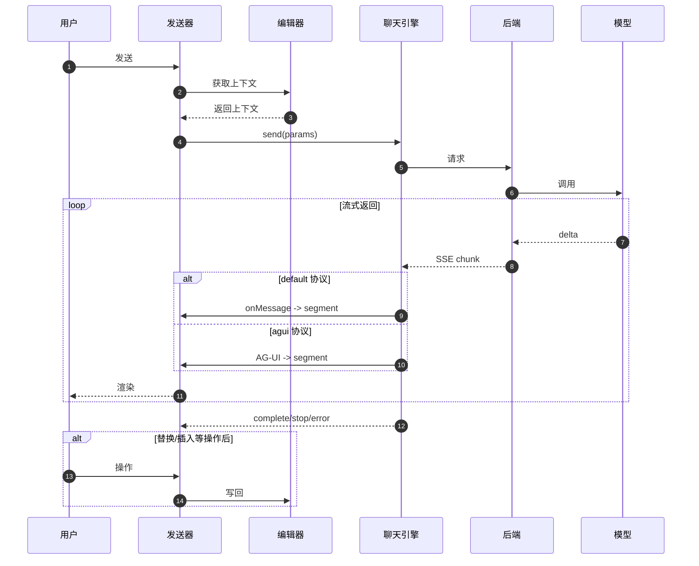

# 前后端交互

本章解释从“用户点击发送”到“收到 AI 回复并写回编辑器”的完整链路，并重点说明前端发送的 `params` 如何帮助模型更好完成任务。

## 端到端流程图



流程中的关键点：

- 构造并发送 params：收集上下文包 + 用户输入，交给聊天引擎发起请求
- 流式解析与渲染：default 协议走 `callbacks.onMessage`；agui 协议走内置解析
- 结果写回编辑器：用户点击“替换/插入”等动作后执行写回

## params 结构（后端真正应该用的输入）

`params` 字段如下（按重要性排序）：

```js
{
  systemPrompt,     // 已替换 {cursorMarker} 的系统提示词
  prompt,           // 用户输入的内容，即用户的要求
  skill,            // 用户所选的技能名称：'write' | 'image' | 'code' | 'mermaid' | 'search'
  from,             // 当前对话的来源：'assistant' | 'chat'
  reasoning,        // 是否深度思考（boolean）
  model,            // 当前模型对象（value/label/endpoint/protocol/...）

  locale,           // 'zh-CN' | 'en-US'
  selectionText,    // 用户选区纯文本（可能为空）
  selectionNodes,   // 选区节点级 Markdown（可能为空；可能含选区标记）
  document,         // 全文 Markdown（含光标/选区标记）

  chatID,           // 当前会话 id（会话 id 相同可认为是连续对话）
  documentID,       // 文档 id（业务可用于检索/存档）
  userID,           // 用户 id（业务可用于配额/审计）

  attachments,      // 可选：聊天附件数组（仅 chat 且启用 files.enabled）
}
```

其中与“编辑任务完成质量”最相关的是：

- `systemPrompt`
- `skill`
- `selectionNodes` / `document`
- `cursorMarker`（已内嵌在 systemPrompt 与 document / selectionNodes 中）

## 后端如何使用 params（建议的 Prompt 组装策略）

### 把 systemPrompt 作为 system role

强建议把 `systemPrompt` 放进模型的 system 消息（或最上层指令），不要混进 user prompt。

- systemPrompt 里包含“输出必须可直接插入 / 替换”“不得破坏 Markdown”等硬约束
- 能明显降低模型输出废话、破坏结构、越界修改的概率

### 根据 skill 做路由与额外约束

`skill` 的作用不止是 UI 展示，它应驱动后端策略：

- `write`：允许生成 / 改写 Markdown；输出应尽量是“可直接替换 / 插入”的内容
- `code`：输出应是代码块 Markdown（避免解释性文字）
- `mermaid`：输出 Mermaid 代码块
- `image`：返回图片 Markdown
- `search`：返回总结/解释，但不要改写文档结构（除非业务定义允许）

推荐做法：为不同 skill 定义不同的后端模板（或不同的 Agent 工具链）。

### 优先用 selectionNodes，而不是 selectionText

选区场景下：

- `selectionText` 会丢结构（列表/表格/代码块）
- `selectionNodes` 是节点级 Markdown，结构更稳，并可能包含选区起止 cursorMarker，可包含多个节点

后端策略建议：

1. 如果 `selectionNodes` 非空：把它作为“允许编辑的唯一范围”（严格约束）
2. 如果选区为空但 `document` 含 cursorMarker：把 cursorMarker 附近上下文作为“局部可编辑区域”
3. 如果两者都为空：提示用户先选中内容或确认插入点（或在后端做降级策略）

### 正确理解 cursorMarker（让模型“知道要改哪”）

`ai.cursorMarker`（默认 `⦙`）会出现在：

- `document`：光标处为 1 个 cursorMarker；选区时为 2 个 cursorMarker（起止）
- `selectionNodes`：可能含起止 cursorMarker；若无法插入 cursorMarker，则可能包裹在首尾
- `systemPrompt`：规则说明中引用该 cursorMarker

后端应该把 cursorMarker 当作“结构化指令”，而不是普通字符：

- 选区：只允许改两 cursorMarker 之间的内容
- 光标：在 cursorMarker 处插入内容；不要改 cursorMarker 以外内容

### 根据 from 区分交互语义

- `assistant`：偏“编辑型输出”，可以更激进地要求输出可写回文档
- `chat`：偏“对话型输出”，允许更多解释/澄清（但仍建议保持简洁）

推荐后端做两套提示词策略：

- assistant：严格输出、少解释、可插入
- chat：更自然、允许多轮、可询问用户缺失信息

### 根据 attachments 建议的使用方式

附件只在满足条件时出现：

- `from === 'chat'`
- `ai.chat.files.enabled === true`
- 用户已上传且上传完成（文件状态不是 progress）

`attachments` 来自 `onFileUpload` 返回信息。

后端常见策略：

- 图片：走 OCR / 视觉模型，提取要点后参与回答
- 文档 / PDF：做切分、向量化检索（RAG），再把相关片段加入上下文
- 表格：解析为结构化数据后再让模型回答

## 推荐的后端接口形态

### SSE + 自定义协议（default）

- 控制输出 JSON 结构
- 前端用 `ai.callbacks.onMessage` 做映射

最低要求：每个 SSE 事件输出一行 JSON（不要直接输出带换行的 Markdown），可以参考：Umo Editor Server 的 [AI SSE 示例接口](../../server/api#ai-sse-示例)。

### SSE + AG-UI（agui）

- 控制输出 AG-UI 事件类型
- 前端自动解析显示（适合 agent 工具调用）

如果准备做“工具调用 / 多步骤任务 / 进度状态”，建议优先 AG-UI，可以参考：Umo Editor Server 的 [AI SSE 示例接口](../../server/api#ai-sse-示例)。
