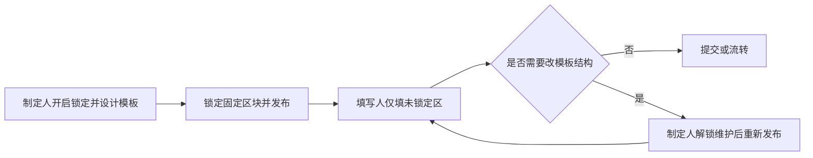

# 内容锁定

内容锁定用于保护文档中的关键内容不被误改。被锁定后，对应内容将不可编辑，并可显示可视化锁定标记，适合模板化、标准化文档等多种场景。

## 使用场景

- **制度/规范类文档**：固定标题、条款、说明区块，避免协作时误改。
- **模板下发场景**：将模板骨架锁定，仅允许填写业务字段。
- **多人协作审阅**：锁定已确认段落，减少反复改动。
- **敏感信息保护**：固定免责声明、法律条款等关键文本。
- **公告与通知发布**：锁定通知正文，只开放日期、联系人等变量区域。
- **问卷/表单填报**：锁定题干与说明，避免填写人误改题目结构。
- **合同草案流转**：锁定已法审通过条款，仅允许修改待确认段落。
- **培训材料复用**：锁定标准教程内容，讲师仅替换案例或补充说明。
- **AI 生成后人工定稿**：锁定已确认段落，限制后续 AI/人工二次覆盖。

## 与其他功能协同使用

### 模板管理（template）

- 模板骨架锁定 + 变量区填写，适合“模板制定人 → 业务填写人”流程：[模板管理](./template)

### 文档修订（revision）

- 模板维护或正文修改时先开启修订留痕，再定稿并锁定关键条款：[文档修订](./revision)

### 多人协作与评论（collaboration/comments）

- 协作中锁定已确认区域，评论用于讨论待确认区域并收敛结论：[多人协作编辑](./collaboration)、[文档批注/评论](./comments)

### 场景实现说明（模板制定 → 业务填写）

以上场景可统一按“模板制定人 + 填写人”双角色流程落地：

1. **模板制定人**在编辑阶段开启内容锁定功能，完成模板骨架编排。  
2. 选中固定区块（合同、制度条款、题干、公告正文、法审通过条款等）执行锁定，仅保留变量区可编辑。  
3. 保存并下发模板给业务填写人。  
4. **填写人**打开模板时，不需要开启“锁定操作入口”，仅在可编辑区域填报业务字段。  
5. 若填写阶段需要调整模板结构，由模板制定人或管理员进入维护流程，解锁后调整并重新锁定再发布。  

> 建议：在协作模式下由模板制定人统一维护锁定策略，填写人仅负责内容填报，可显著降低误改和结构漂移风险。



## 功能入口

### 视图菜单

在工具栏 `视图` 分组中，使用 `锁定内容` 菜单可执行：

- 锁定/取消锁定当前选区
- 清除全部锁定
- 打开锁定选项（开关、标记样式）

### 气泡菜单

在气泡菜单中，点击锁定按钮可锁定当前所选内容。

### 块菜单

在段落/节点左侧块菜单中，点击锁定按钮可按当前节点状态自动切换：

- 未锁定时：锁定该节点内容
- 已锁定时：取消锁定该节点内容

## 默认配置

```js
const defaultOptions = {
  // 内容锁定配置
  locked: {
    enabled: true,
    showMarker: true,
    markerBackgroundColor: 'rgba(0, 0, 0, 0.1)',
    markerTextColor: 'inherit',
  },
}
```

## 配置项说明

### locked.enabled

**说明**：是否启用锁定能力。该开关主要控制视图菜单、块菜单、气泡菜单等功能入口的显示与交互。即使关闭，仍可通过下方“方法列表”中的 API 继续执行锁定相关操作。

**类型**：`Boolean`

**默认值**：`true`

**示例**：`false`

### locked.showMarker

**说明**：是否显示锁定标记样式。关闭后仅隐藏视觉标记，不影响实际锁定行为。

**类型**：`Boolean`

**默认值**：`true`

**示例**：`false`

### locked.markerBackgroundColor

**说明**：锁定标记背景色（文本与节点高亮）。

**类型**：`String`

**默认值**：`'rgba(0, 0, 0, 0.1)'`

**示例**：`'rgba(255, 193, 7, 0.25)'`

### locked.markerTextColor

**说明**：锁定文本前景色。

**类型**：`String`

**默认值**：`'inherit'`

**示例**：`'#7a4e00'`

## 方法列表

方法的使用示例请参考：[方法列表](../editor/methods)。

### setSelectionLocked

**说明**：锁定当前选区内容。

**参数**：无

**返回值**：`Boolean | undefined`

### unsetSelectionLocked

**说明**：取消当前选区锁定。

**参数**：无

**返回值**：`Boolean | undefined`

### toggleSelectionLocked

**说明**：按当前状态切换锁定/解锁。

**参数**：无

**返回值**：`Boolean | undefined`

### clearAllLocked

**说明**：清除整篇文档中的全部锁定内容。

**参数**：无

**返回值**：`Boolean | undefined`

### setLockedEnabled

**说明**：启用或禁用锁定能力。

**参数**：

- `enabled`，Boolean，默认值 `true`。

**返回值**：`Boolean | undefined`

### isLockedEnabled

**说明**：获取锁定能力是否启用。

**参数**：无

**返回值**：`Boolean`

### isSelectionLocked

**说明**：判断当前选区是否包含锁定内容。

**参数**：无

**返回值**：`Boolean`

### setLockedMarkerVisible

**说明**：设置锁定标记是否可见。

**参数**：

- `visible`，Boolean，默认值 `true`。

**返回值**：无

### setLockedMarkerStyle

**说明**：设置锁定标记样式。

**参数**：

- `params`，Object，可选字段：
  - `markerBackgroundColor`，String
  - `markerTextColor`，String

**返回值**：无

## 使用示例

### 1) 初始化时开启并自定义样式

```js
const defaultOptions = {
  locked: {
    enabled: true,
    showMarker: true,
    markerBackgroundColor: 'rgba(255, 193, 7, 0.2)',
    markerTextColor: '#8a5a00',
  },
}
```

### 2) 运行时切换锁定能力与样式

```js
const editorRef = ref(null)

editorRef.value?.setLockedEnabled(true)
editorRef.value?.setLockedMarkerVisible(true)
editorRef.value?.setLockedMarkerStyle({
  markerBackgroundColor: 'rgba(0, 128, 255, 0.12)',
  markerTextColor: '#0b63c9',
})
```

### 3) 清除全部锁定

```js
editorRef.value?.clearAllLocked()
```

## 注意事项

- 锁定主要用于“防误改”，被锁定内容将拦截编辑事务。
- 关闭 `locked.showMarker` 仅隐藏视觉标记，不会取消锁定状态。


## 预置锁定内容

如果您以 JSON 形式初始化文档，可以直接在内容数据中写入锁定标记，实现“加载即锁定”。

### 锁定文本内容

为文本节点添加 `lockedText` mark：

```json
{
  "type": "doc",
  "content": [
    {
      "type": "paragraph",
      "content": [
        {
          "type": "text",
          "text": "这段文本加载后即为锁定状态",
          "marks": [{ "type": "lockedText" }]
        }
      ]
    }
  ]
}
```

### 锁定节点内容

为节点的 `attrs` 添加 `lockedNode: true`：

```json
{
  "type": "doc",
  "content": [
    {
      "type": "image",
      "attrs": {
        "src": "https://example.com/demo.png",
        "alt": "示例图片",
        "lockedNode": true
      }
    }
  ]
}
```

### 说明

- `lockedText` 适合段落中的文本级锁定。
- `lockedNode` 适合图片、文件、音视频等节点级锁定。
- 二者可混合使用，以满足“模板骨架 + 可编辑变量区”场景。
