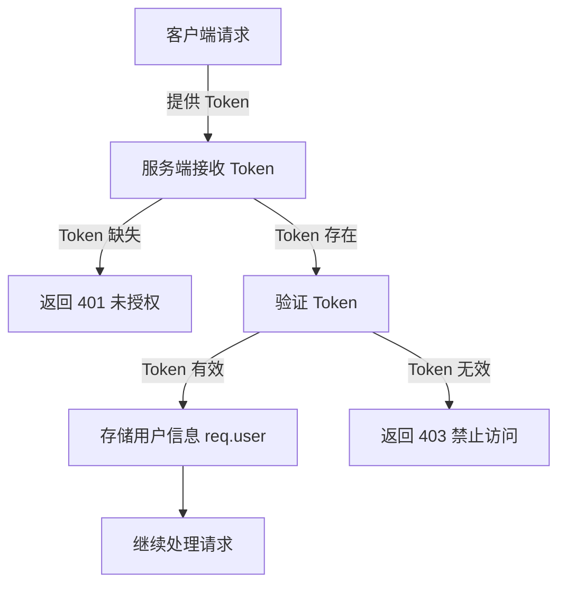

# 鉴权说明

## 鉴权流程

在服务端中，鉴权是确保用户身份合法性的重要环节。以下是一个典型的鉴权流程：

1. **Token 提供（客户端: 即 Umo Editor Next）**：
   - 在正常情况下，Token 在请求头中以 `Bearer` 的形式传递。
   - 在 WebSocket 中，Token 应通过请求的查询参数传递，例如：`ws://localhost:3000/provider?token=xxx`。

2. **Token 验证（服务器端：即 Umo Editor Server）**：
   - 如果没有提供 Token，则返回 `401 未授权` 错误。
   - 如果提供了 Token，则验证其有效性。
   - 如果 Token 有效，将用户信息存储在 `req.user` 中，供后续使用。
   - 如果 Token 无效，则返回 `403 禁止访问` 错误。

3. **Token 生成与解码**：
   - Token 应由客户的后端生成，并由 Umo Editor Next 传递到 Umo Editor Server 进行解码。
   - Token 的私钥在 `.env` 文件中配置，需客户的后端保持一致，以确保正确解码。

以下是使用 `jsonwebtoken` 以中间件的形式验证 Token 的示例代码，您可以根据实际业务自行实现鉴权逻辑。

```javascript
import jwt from 'jsonwebtoken'

export default (req, res, next) => {
  const token = req.headers['authorization']?.split(' ')[1]
  if (!token) {
    return res.error(401, '未提供 Token')
  }

  try {
    const decoded = jwt.verify(token, process.env.JWT_SECRET)
    req.user = decoded
    next()
  } catch (err) {
    return res.error(403, '无效的 Token')
  }
}
```

### 鉴权流程图

以下是鉴权流程的流程图：

