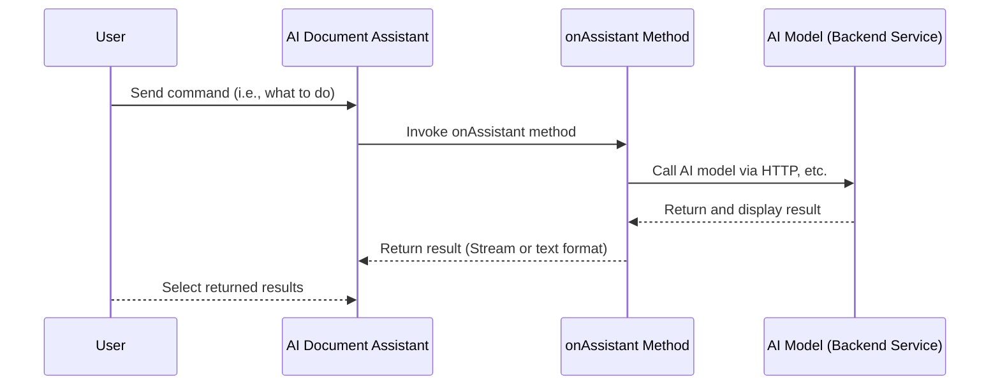

# AI Document Assistant

The AI Document Assistant is an efficiency tool integrated with artificial intelligence technology, primarily designed to enhance the efficiency of document creation.

The AI Document Assistant passes the content selected by the user and the input instructions to the AI model. The AI model, based on this information, generates document content that meets the requirements and returns the results to the AI Document Assistant.

## Technical Principles

### Process Description
1. The user sends a command to the AI Document Assistant, specifying the action they wish to perform.
2. The AI Document Assistant then invokes a method named `onAssistant`.
3. The `onAssistant` method calls the AI model via HTTP or other means.
4. The AI model processes the request and then returns and displays the result.
5. The `onAssistant` method returns the result in a readable stream or text format to the AI Document Assistant.
6. The user selects the results returned by the AI Document Assistant.

### Sequence Diagram

## Use Cases

The AI Document Assistant can be applied in various scenarios, providing efficient and intelligent document processing services. Here are some common use cases:

1. **Document Translation**: Translating documents from one language to another.
2. **Document Summarization**: Automatically generating summaries or overviews of document content.
3. **Content Proofreading**: Checking for grammatical errors, spelling mistakes, etc., in documents.
4. **Format Conversion**: Converting documents from one format to another, such as from PDF to Word.
5. **Information Extraction**: Extracting key information from documents, such as names, locations, dates, etc.
6. **Content Recommendation**: Recommending related documents based on users' historical reading habits.
7. **Intelligent Writing**: Generating document content that meets the requirements based on user input.
8. **Data Entry**: Converting data from paper documents or images into electronic format.
9. **Document Organization**: Assisting users in organizing messy documents to make them orderly.
10. **Knowledge Management**: Building a knowledge base to help users manage and retrieve information.
11. **Automated Report Generation**: Automatically generating reports based on data and templates.
12. **Legal Document Review**: Assisting legal professionals in reviewing contracts and other legal documents.
13. **Academic Research**: Assisting researchers in literature searches, data organization, and citation management.
14. **Educational Support**: Assisting teachers and students in organizing course materials and creating study notes.
15. **Additional Use Cases**: ...

By utilizing the AI Document Assistant, work efficiency can be significantly increased, repetitive labor can be reduced, and users can focus on more creative and strategic tasks.