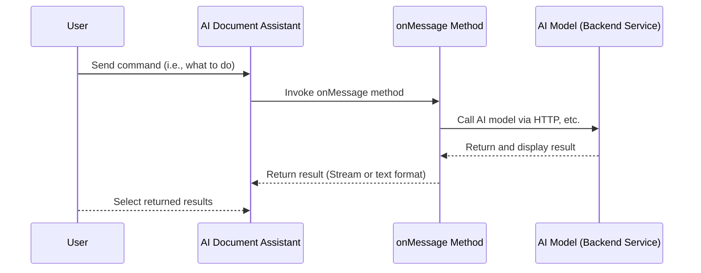

import { Tabs, Callout } from 'nextra/components'

# AI Document Assistant

The AI Document Assistant is an intelligent interaction feature designed for document editing scenarios, aimed at helping users efficiently manage and process document content.

It supports common document operations such as continuation, rewriting, expansion, abbreviation, polishing, proofreading, and translation, based on selected text or surrounding context. Through a configurable command system, it accurately conveys user intentions to AI models and generates results that conform to the current language and formatting requirements.

The AI Document Assistant can be seamlessly integrated with various large language models, supports streaming responses and rich-text output, and is suitable for writing assistance, content optimization, and multilingual processing, significantly improving both editing efficiency and content quality.

## Screenshots

// TODO

## Demo Video

// TODO

## Technical Principles

### Process Description

1. The user sends a command to the AI Document Assistant, specifying the action they wish to perform.
2. The AI Document Assistant then invokes a method named `ai.assistant.onMessage`.
3. The `ai.assistant.onMessage` method calls the AI model via HTTP or other means.
4. The AI model processes the request and then returns and displays the result.
5. The `ai.assistant.onMessage` method returns the result in a readable stream or text format to the AI Document Assistant.
6. The user selects the results returned by the AI Document Assistant.

### Sequence Diagram



## Use Cases

The AI Document Assistant can be applied in various scenarios, providing efficient and intelligent document processing services. Here are some common use cases:

1. **Document Translation**: Translating documents from one language to another.
2. **Document Summarization**: Automatically generating summaries or overviews of document content.
3. **Content Proofreading**: Checking for grammatical errors, spelling mistakes, etc., in documents.
4. **Format Conversion**: Converting documents from one format to another, such as from PDF to Word.
5. **Information Extraction**: Extracting key information from documents, such as names, locations, dates, etc.
6. **Content Recommendation**: Recommending related documents based on users' historical reading habits.
7. **Intelligent Writing**: Generating document content that meets the requirements based on user input.
8. **Data Entry**: Converting data from paper documents or images into electronic format.
9. **Document Organization**: Assisting users in organizing messy documents to make them orderly.
10. **Knowledge Management**: Building a knowledge base to help users manage and retrieve information.
11. **Automated Report Generation**: Automatically generating reports based on data and templates.
12. **Legal Document Review**: Assisting legal professionals in reviewing contracts and other legal documents.
13. **Academic Research**: Assisting researchers in literature searches, data organization, and citation management.
14. **Educational Support**: Assisting teachers and students in organizing course materials and creating study notes.
15. **Additional Use Cases**: ...

By utilizing the AI Document Assistant, work efficiency can be significantly increased, repetitive labor can be reduced, and users can focus on more creative and strategic tasks.

## Default Configuration

```js
{
  ai: {
    assistant: {
      enabled: false,
      maxlength: 100,
      commands: [
        {
          label: { en_US: 'Continuation', zh_CN: '续写' },
          value: { en_US: 'Continuation', zh_CN: '续写' },
        },
        {
          label: { en_US: 'Rewrite', zh_CN: '重写' },
          value: { en_US: 'Rewrite', zh_CN: '重写' },
        },
        {
          label: { en_US: 'Abbreviation', zh_CN: '缩写' },
          value: { en_US: 'Abbreviation', zh_CN: '缩写' },
        },
        {
          label: { en_US: 'Expansion', zh_CN: '扩写' },
          value: { en_US: 'Expansion', zh_CN: '扩写' },
        },
        {
          label: { en_US: 'Polish', zh_CN: '润色' },
          value: { en_US: 'Polish', zh_CN: '润色' },
        },
        {
          label: { en_US: 'Proofread', zh_CN: '校阅' },
          value: { en_US: 'Proofread', zh_CN: '校阅' },
        },
        {
          label: { en_US: 'Translate', zh_CN: '翻译' },
          value: { en_US: 'Translate', zh_CN: '翻译' },
          autoSend: false,
        },
      ],
      async onMessage() {
        return await new Promise((_, reject) => {
          reject(
            new Error(
              'Key "ai": Key "assistant": Key "onMessage": Please set the onMessage method',
            ),
          )
        })
      },
    },
  },
}
```

## Configuration Description

### ai.assistant.enabled

**Description**: Whether to enable the AI Document Assistant feature.

**Type**: `Boolean`

**Default Value**: `false`

### ai.assistant.maxlength

**Description**: The maximum length of commands that the AI Document Assistant can process.

**Type**: `Number`

**Default Value**: `100`

### ai.assistant.commands

**Description**: Common command configurations for the AI Document Assistant panel.

**Type**: `Array`

**Default Value**:

```js
;[
  {
    label: { en_US: 'Continuation', zh_CN: '续写' },
    value: { en_US: 'Continuation', zh_CN: '续写' },
  },
  {
    label: { en_US: 'Rewrite', zh_CN: '重写' },
    value: { en_US: 'Rewrite', zh_CN: '重写' },
  },
  {
    label: { en_US: 'Abbreviation', zh_CN: '缩写' },
    value: { en_US: 'Abbreviation', zh_CN: '缩写' },
  },
  {
    label: { en_US: 'Expansion', zh_CN: '扩写' },
    value: { en_US: 'Expansion', zh_CN: '扩写' },
  },
  {
    label: { en_US: 'Polish', zh_CN: '润色' },
    value: { en_US: 'Polish', zh_CN: '润色' },
  },
  {
    label: { en_US: 'Proofread', zh_CN: '校阅' },
    value: { en_US: 'Proofread', zh_CN: '校阅' },
  },
  {
    label: { en_US: 'Translate', zh_CN: '翻译' },
    value: { en_US: 'Translate', zh_CN: '翻译' },
    autoSend: false,
  },
]
```

**Configuration Items**:

- `item.label`: `String` or `Object`, the text displayed in the AI Document Assistant panel.
- `item.value`: `String` or `Object`, the actual command sent to `onMessage`.
- `item.autoSend`: `Boolean`, whether to automatically send the command to `onMessage` when the user selects it. Default is `true`. If set to `false`, the user can modify the command and manually click the button to send it.

### ai.assistant.onMessage

**Description**: Configures the method for returning data from the AI Document Assistant. For more information, see [AI Document Assistant](../ai).

**Type**: `AsyncFunction`, `Promise`.

**Parameters**:

- `payload`: Request parameters for the AI Document Assistant, which can be passed to the AI model.
  1. `payload.lang`: `String`, the current interface language.
  2. `payload.input`: `String`, the text content selected by the user.
  3. `payload.command`: `String`, the command entered by the user.
  4. `payload.output`: `String`, the desired content format from the AI Document Assistant. Possible values: `rich-text`, `text`.
- `content`: The current document content. You can pass the document content to the AI model, but note that overly long documents may exceed the AI model's processing capabilities. If using a commercial AI model, long token inputs may also significantly increase costs.
  1. `content.text`: `String`, the text content of the current document.
  2. `content.html`: `String`, the HTML content of the current document.
  3. `content.json`: `Object`, the JSON content of the current document.

**Example**:

The following example demonstrates how to configure the `onMessage` method to pass document content to an AI model, process it, and return the AI model's response using OpenAI as an example.

The OpenAI API specification has become an industry standard. In fact, many AI models support being called via the [`OpenAI SDK`](https://www.npmjs.com/package/openai).

<Tabs items={['Global Configuration', 'SFC Configuration']}>
<Tabs.Tab>
```js
import { useUmoEditor } from '@umoteam/editor'
import OpenAI from 'openai'

const onMessage = async (payload, content) => {
  console.log(payload, content)
  const { command, lang, input, output } = payload
  const client = new OpenAI({
    baseURL: '...',
    apiKey: '...',
    dangerouslyAllowBrowser: true, // Allow using OpenAI SDK in the browser
  })
  const langs = {
    'en-US': 'English',
    'zh-CN': 'Chinese',
  }
  const options = {
    stream: true,
    model: '...',
    messages: [
      {
        role: 'system',
        content: `You are a document assistant. Based on the user's input text or HTML content and the corresponding operation command, generate document content that meets the requirements. Requirements: 1. If the command does not require translation, return in ${langs[lang]}; otherwise, return in the language specified by the user. 2. Return in ${output === 'rich-text' ? 'rich-text (HTML)' : 'plain text (remove HTML tags)'} format. 3. If you cannot understand the user's command, prepend "[ERROR]: " to the returned content. 4. Do not return any other unnecessary content.`,
      },
      {
        role: 'user',
        content: `Perform the following operation: [${command}].\n${input}`,
      },
    ],
  }
  const completion = await client.chat.completions.create(options)
  const stream = new ReadableStream({
    async start(controller) {
      for await (const chunk of completion) {
        controller.enqueue(chunk.choices[0]?.delta?.content || '')
      }
      controller.close()
    },
  })
  return stream
}

const options = {
  ai: {
    assistant: {
      enabled: true,
      onMessage,
    },
  },
}

app.use(useUmoEditor, options)
````
</Tabs.Tab>
<Tabs.Tab>
```vue
<template>
  <umo-editor
    v-bind="options"
  />
</template>

<script setup>
import { UmoEditor } from '@umoteam/editor'
import OpenAI from 'openai'

const onMessage = async (payload, content) => {
  console.log(payload, content)
  const { command, lang, input, output } = payload
  const client = new OpenAI({
    baseURL: '...',
    apiKey: '...',
    dangerouslyAllowBrowser: true, // Allow using OpenAI SDK in the browser
  })
  const langs = {
    'en-US': 'English',
    'zh-CN': 'Chinese',
  }
  const options = {
    stream: true,
    model: '...',
    messages: [
      {
        role: 'system',
        content: `You are a document assistant. Based on the user's input text or HTML content and the corresponding operation command, generate document content that meets the requirements. Requirements: 1. If the command does not require translation, return in ${langs[lang]}; otherwise, return in the language specified by the user. 2. Return in ${output === 'rich-text' ? 'rich-text (HTML)' : 'plain text (remove HTML tags)'} format. 3. If you cannot understand the user's command, prepend "[ERROR]: " to the returned content. 4. Do not return any other unnecessary content.`,
      },
      {
        role: 'user',
        content: `Perform the following operation: [${command}].\n${input}`,
      },
    ],
  }
  const completion = await client.chat.completions.create(options)
  const stream = new ReadableStream({
    async start(controller) {
      for await (const chunk of completion) {
        controller.enqueue(chunk.choices[0]?.delta?.content || '')
      }
      controller.close()
    },
  })
  return stream
}

const options = {
  ai: {
    assistant: {
      enabled: true,
      onMessage,
    },
  },
}
</script>
````

</Tabs.Tab>
</Tabs>

<Callout type="error">
  **Note:** The above code is for demonstration purposes only. In actual
  applications, sensitive information such as `apiKey` should not be exposed on
  the client side. Instead, the AI model should be called through a backend
  service, and the `apiKey` should be stored on the backend to protect sensitive
  information. The above logic should also be implemented on the backend as much
  as possible to reduce request load.
</Callout>

**Return Value**: `String`, `ReadableStream`.
