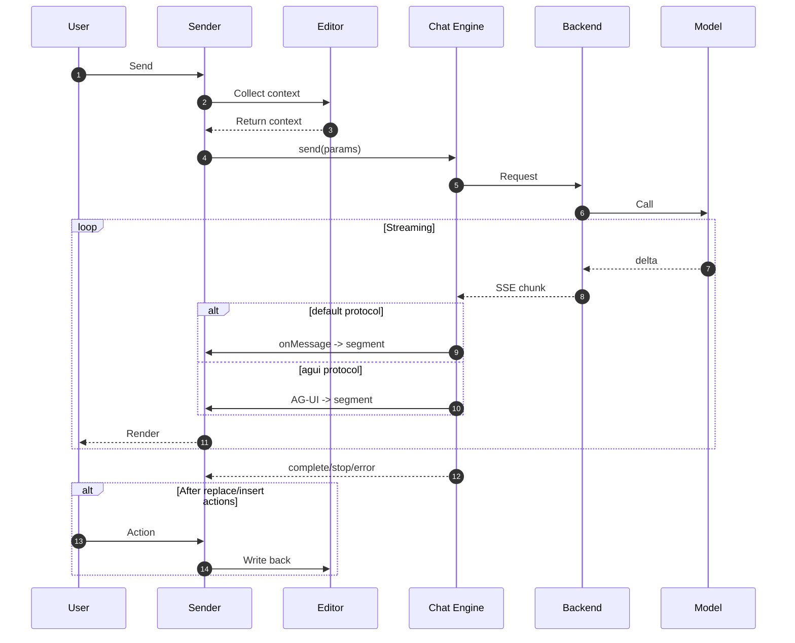

# Frontend/Backend Flow

This chapter explains the full pipeline from “user clicks Send” to “AI response is received and written back into the editor”, and highlights how the frontend `params` help the model do a better job.

## End-to-end sequence diagram



Key points in this flow:

- Build and send `params`: collect context + user input, then let the chat engine send the request
- Stream parsing and rendering: `default` uses `callbacks.onMessage`; `agui` uses built-in parsing
- Write back into the editor: write back after the user clicks actions like “Replace/Insert”

## params structure (the real backend input)

`params` fields (roughly ordered by importance):

```js
{
  systemPrompt,     // System prompt with {cursorMarker} already substituted
  prompt,           // User prompt (what the user asked for)
  skill,            // Selected skill: 'write' | 'image' | 'code' | 'mermaid' | 'search'
  from,             // Source: 'assistant' | 'chat'
  reasoning,        // Reasoning enabled (boolean)
  model,            // Current model object (value/label/endpoint/protocol/...)
  messages,         // All messages in this session (array)

  locale,           // 'zh-CN' | 'en-US'
  selectionText,    // Selected plain text (may be empty)
  selectionNodes,   // Selection as node-level Markdown (may be empty; may include markers)
  document,         // Full document Markdown (with cursor/selection markers)
  cursorMarker,     // Cursor marker (default '⦙')

  chatID,           // Chat session id (same id implies a continuous session)
  documentID,       // Document id (for retrieval/archiving in your app)
  userID,           // User id (for quotas/audit in your app)

  attachments,      // Optional: attachments array (chat only, when files.enabled)
}
```

The fields most related to editing quality are:

- `systemPrompt`
- `skill`
- `selectionNodes` / `document`
- `cursorMarker` (embedded in `systemPrompt` and in `document` / `selectionNodes`)

## How the backend should use params (recommended prompt strategy)

### Put systemPrompt in the system role

It is strongly recommended to put `systemPrompt` into the model system message (or top-level instruction), not mixed into the user prompt.

- `systemPrompt` contains hard constraints such as “output must be directly insertable/replacable” and “must not break Markdown structure”
- This significantly reduces fluff, structure-breaking output, and out-of-scope edits

### Route and constrain by skill

`skill` is not just for UI—it should drive your backend strategy:

- `write`: allow generating/rewriting Markdown; output should be directly insertable/replacable content
- `code`: output should be Markdown code blocks (avoid explanatory text)
- `mermaid`: output Mermaid code blocks
- `image`: return image Markdown
- `search`: return summaries/explanations, but do not rewrite document structure (unless your product definition allows it)

Recommended: define different backend templates (or agent toolchains) for each skill.

### Prefer selectionNodes over selectionText

In selection scenarios:

- `selectionText` loses structure (lists/tables/code blocks)
- `selectionNodes` preserves node-level Markdown, is more stable, and may include start/end markers; it can include multiple nodes

Backend strategy:

1. If `selectionNodes` is not empty: treat it as the only allowed editable range (strict)
2. If there is no selection but `document` contains a cursor marker: treat nearby context as a locally editable area
3. If both are empty: ask the user to select content or confirm an insertion point (or apply a backend fallback)

### Interpret cursorMarker correctly (so the model knows what to change)

`ai.cursorMarker` (default `⦙`) can appear in:

- `document`: 1 marker for cursor; 2 markers for a selection (start/end)
- `selectionNodes`: may contain start/end markers; if insertion is not possible, it may be wrapped at the beginning/end
- `systemPrompt`: rules reference this marker

Treat the cursor marker as a structured instruction, not a normal character:

- Selection: only modify content between the two markers
- Cursor: insert content at the marker; do not change content outside the marker

### Use from to distinguish interaction semantics

- `assistant`: editing-oriented output; require content that can be written back
- `chat`: conversation-oriented output; allow more explanation/clarification (still keep it concise)

Recommended: maintain two prompt strategies:

- assistant: strict output, minimal explanation, insertable
- chat: more natural, multi-turn, can ask for missing information

### How to use attachments

Attachments appear only when:

- `from === 'chat'`
- `ai.chat.files.enabled === true`
- The user uploaded files and the upload completed (status is not `progress`)

`attachments` come from your `onFileUpload` return value.

Common backend strategies:

- Images: OCR or vision models, then use extracted content for responses
- Documents/PDF: chunk + retrieval (RAG), then add relevant snippets into context
- Tables: parse into structured data, then let the model answer

## Recommended backend interface shapes

### SSE + custom protocol (default)

- You control the JSON output structure
- Frontend maps chunks via `ai.callbacks.onMessage`

Minimum requirement: each SSE event outputs a single line of JSON (do not output Markdown with real newlines directly). See: Umo Editor Server [AI SSE demo endpoints](../../server/api#ai-sse-示例).

### SSE + AG-UI (agui)

- You output AG-UI event types
- Frontend parses and renders automatically (great for agent tool calls)

If you plan to do tool calling, multi-step tasks, or progress/status, prefer AG-UI. See: Umo Editor Server [AI SSE demo endpoints](../../server/api#ai-sse-示例).
