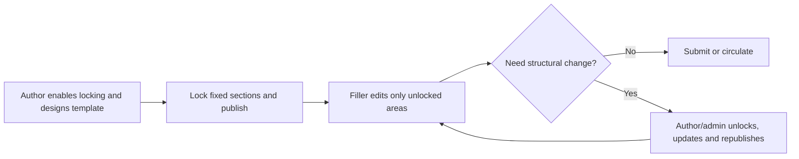

# Content Locking

Content Locking protects key parts of a document from accidental edits. Once locked, the target content becomes non-editable and can be highlighted with lock markers, which is ideal for template-driven and standardized documents.

## Use Cases

- **Policy/standard documents**: keep titles, clauses, and notices fixed during collaboration.
- **Template distribution**: lock the document skeleton and leave only business fields editable.
- **Collaborative review**: lock approved paragraphs to reduce repeated changes.
- **Sensitive content protection**: lock disclaimers, legal clauses, and compliance text.
- **Announcement publishing**: lock the main body while allowing only variable fields (date/contact) to change.
- **Form/questionnaire filling**: lock prompts and instructions to prevent structural edits.
- **Contract draft circulation**: lock legally reviewed clauses and keep only pending sections editable.
- **Training material reuse**: lock standard tutorial blocks and update only examples.
- **Post-AI finalization**: lock finalized sections to prevent further AI/manual overwrite.

### Implementation Pattern (Template Authoring → Business Filling)

All scenarios above can be implemented with a two-role workflow: template author + filler.

1. The **template author** enables content locking during template design and builds the template skeleton.  
2. Lock fixed sections (contracts, policy clauses, prompts, announcement body, legally reviewed clauses), and keep only variable fields editable.  
3. Save and distribute the template to business fillers.  
4. The **filler** opens the template and fills only editable areas, without needing to enable lock operation entries.  
5. If structural changes are required during filling, the template author or admin enters maintenance flow: unlock, adjust, relock, and republish.  

> Recommendation: In collaboration mode, let template authors maintain lock strategy centrally, while fillers focus on data entry. This significantly reduces accidental edits and structure drift.



## Entry Points

### View Menu

In the toolbar `View` group, use `Content Locking` to:

- lock/unlock current selection
- clear all locks
- open lock options (enable switch and marker styles)

### Bubble Menu

In the bubble menu, click the lock button to lock the current selected content.

### Block Menu

In the left block menu of a paragraph/node, the lock button auto toggles by state:

- if unlocked: lock node content
- if locked: unlock node content

## Default Configuration

```js
const defaultOptions = {
  // Content locking configuration
  locked: {
    enabled: true,
    showMarker: true,
    markerBackgroundColor: 'rgba(0, 0, 0, 0.1)',
    markerTextColor: 'inherit',
  },
}
```

## Configuration Reference

### locked.enabled

**Description**: enables/disables locking entry points in menus. Even when disabled, you can still operate locking through the APIs listed in the Methods section below.

**Type**: `Boolean`

**Default**: `true`

**Example**: `false`

### locked.showMarker

**Description**: controls lock marker visibility. Turning it off only hides markers and does not change lock behavior.

**Type**: `Boolean`

**Default**: `true`

**Example**: `false`

### locked.markerBackgroundColor

**Description**: background color for lock markers (text and node highlighting).

**Type**: `String`

**Default**: `'rgba(0, 0, 0, 0.1)'`

**Example**: `'rgba(255, 193, 7, 0.25)'`

### locked.markerTextColor

**Description**: foreground color for locked text.

**Type**: `String`

**Default**: `'inherit'`

**Example**: `'#7a4e00'`

## Methods

For method call patterns, see [Methods](../editor/methods).

### setSelectionLocked

**Description**: locks current selection content.

**Parameters**: none

**Returns**: `Boolean | undefined`

### unsetSelectionLocked

**Description**: unlocks current selection.

**Parameters**: none

**Returns**: `Boolean | undefined`

### toggleSelectionLocked

**Description**: toggles lock/unlock by current state.

**Parameters**: none

**Returns**: `Boolean | undefined`

### clearAllLocked

**Description**: clears all locks in the current document.

**Parameters**: none

**Returns**: `Boolean | undefined`

### setLockedEnabled

**Description**: enables/disables locking capability.

**Parameters**:

- `enabled`, Boolean, default `true`.

**Returns**: `Boolean | undefined`

### isLockedEnabled

**Description**: gets whether locking capability is enabled.

**Parameters**: none

**Returns**: `Boolean`

### isSelectionLocked

**Description**: checks whether current selection contains locked content.

**Parameters**: none

**Returns**: `Boolean`

### setLockedMarkerVisible

**Description**: sets lock marker visibility.

**Parameters**:

- `visible`, Boolean, default `true`.

**Returns**: none

### setLockedMarkerStyle

**Description**: sets lock marker styles.

**Parameters**:

- `params`, Object, optional fields:
  - `markerBackgroundColor`, String
  - `markerTextColor`, String

**Returns**: none

## Examples

### 1) Enable on init and customize styles

```js
const defaultOptions = {
  locked: {
    enabled: true,
    showMarker: true,
    markerBackgroundColor: 'rgba(255, 193, 7, 0.2)',
    markerTextColor: '#8a5a00',
  },
}
```

### 2) Toggle capability and marker style at runtime

```js
const editorRef = ref(null)

editorRef.value?.setLockedEnabled(true)
editorRef.value?.setLockedMarkerVisible(true)
editorRef.value?.setLockedMarkerStyle({
  markerBackgroundColor: 'rgba(0, 128, 255, 0.12)',
  markerTextColor: '#0b63c9',
})
```

### 3) Clear all locks

```js
editorRef.value?.clearAllLocked()
```

## Notes

- Content locking is primarily used to prevent accidental edits. Locked content blocks editing transactions.
- Turning off `locked.showMarker` only hides visual markers and does not unlock content.

## Pre-lock Content via JSON

If you initialize the editor with JSON content, you can write lock markers directly into the document so it is locked immediately after loading.

### Lock text content

Add the `lockedText` mark to text nodes:

```json
{
  "type": "doc",
  "content": [
    {
      "type": "paragraph",
      "content": [
        {
          "type": "text",
          "text": "This text is locked on load.",
          "marks": [{ "type": "lockedText" }]
        }
      ]
    }
  ]
}
```

### Lock node content

Add `lockedNode: true` in node `attrs`:

```json
{
  "type": "doc",
  "content": [
    {
      "type": "image",
      "attrs": {
        "src": "https://example.com/demo.png",
        "alt": "Example image",
        "lockedNode": true
      }
    }
  ]
}
```

### Notes

- `lockedText` is suitable for text-level locking in paragraphs.
- `lockedNode` is suitable for node-level locking such as images, files, audio, and video.
- You can combine both to support “locked template skeleton + editable variable regions”.
