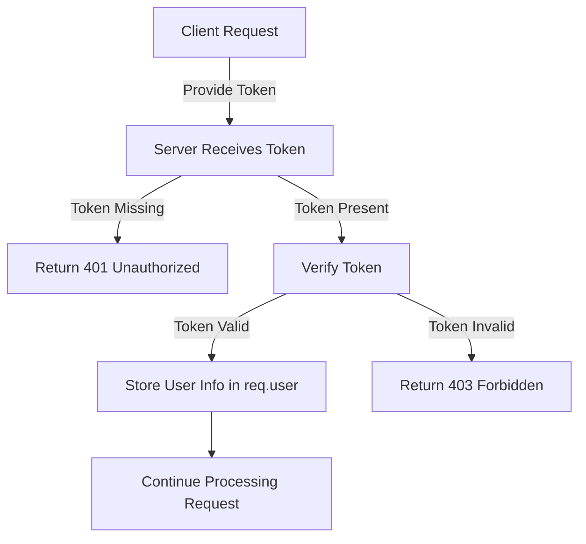

# Authentication

## Authentication Process

On the server side, authentication is a crucial step to ensure the legitimacy of user identity. Below is a typical authentication process:

1. **Token Provision (Client: Umo Editor Next)**:
   - Normally, the Token is passed in the request header in the form of `Bearer`.
   - In WebSocket, the Token should be passed through the query parameters of the request, e.g., `ws://localhost:3000/provider?token=xxx`.

2. **Token Verification (Server: Umo Editor Server)**:
   - If no Token is provided, a `401 Unauthorized` error is returned.
   - If a Token is provided, its validity is verified.
   - If the Token is valid, the user information is stored in `req.user` for subsequent use.
   - If the Token is invalid, a `403 Forbidden` error is returned.

3. **Token Generation and Decoding**:
   - The Token should be generated by the client's backend and passed from Umo Editor Next to Umo Editor Server for decoding.
   - The private key for the Token is configured in the `.env` file and must be consistent with the client's backend to ensure correct decoding.

Below is an example of using `jsonwebtoken` to verify the Token as middleware. You can implement the authentication logic based on your actual business needs.

```javascript
import jwt from 'jsonwebtoken'

export default (req, res, next) => {
  const token = req.headers['authorization']?.split(' ')[1]
  if (!token) {
    return res.error(401, 'Token not provided')
  }

  try {
    const decoded = jwt.verify(token, process.env.JWT_SECRET)
    req.user = decoded
    next()
  } catch (err) {
    return res.error(403, 'Invalid Token')
  }
}
```

### Authentication Process Diagram

Below is a flowchart of the authentication process:


